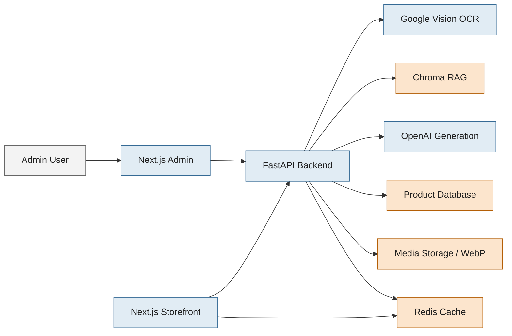

# Naramkova Moda v2

English: see [README.en.md](README.en.md)  
Russian: see [README.ru.md](README.ru.md)

## Turn Product Images Into Sellable Listings

> Upload 10, 50, or 100 images at once.  
> The system analyzes the images, extracts visual and textual signals, retrieves the closest product style via RAG, drafts the copy, suggests the price, and pushes the result into the e-commerce workflow.

## Why This Project Exists

Most stores waste time on manual product entry. This project is built around the opposite idea:

- images come first
- AI handles the repetitive product-copy work
- RAG keeps outputs aligned with real store style
- Redis reduces repeated expensive operations
- admin keeps final control, but without doing everything manually

## What Makes It Different

| Capability | What It Means In Practice |
| --- | --- |
| Bulk image ingestion | Process large batches such as 100 images in one session |
| OCR / Vision pipeline | Read labels, objects, web entities, and text from product images |
| RAG-driven consistency | Reuse style and structure from stored product templates in Chroma |
| Automatic draft generation | Create title, description, SEO fields, tags, and suggested price |
| Direct shop creation | Turn processed media into products or variants inside the admin flow |
| Redis-backed acceleration | Cache repeated data and reduce unnecessary heavy requests |

## Visual Overview

```mermaid
flowchart LR
    classDef source fill:#fff2cc,stroke:#b08900,color:#1f1f1f;
    classDef process fill:#d9ead3,stroke:#2f6f3e,color:#1f1f1f;
    classDef ai fill:#d0e0ff,stroke:#2c5aa0,color:#1f1f1f;
    classDef output fill:#f4cccc,stroke:#a61c1c,color:#1f1f1f;

    A["Bulk Upload<br/>10 / 50 / 100 images"]:::source --> B["Admin Media Inbox"]:::process
    B --> C["WebP Conversion"]:::process
    C --> D["OCR / Vision Analysis<br/>labels, objects, text"]:::ai
    D --> E["Tag Normalization<br/>Product Type Detection"]:::process
    E --> F["RAG Retrieval From Chroma<br/>templates and examples"]:::ai
    F --> G["LLM Draft Generation<br/>title, description, SEO, price"]:::ai
    G --> H["Admin Review / Assign"]:::process
    H --> I["Product or Variant Created"]:::output
    I --> J["Visible In Storefront"]:::output
```





## The Core AI Pipeline

1. Product images are uploaded into the admin media inbox.
2. Backend converts them to WebP and stores them in the media workflow.
3. OCR / vision processing extracts labels, objects, web entities, and visible text.
4. The system normalizes tags and detects the likely product type.
5. Chroma RAG searches for the closest matching product templates and prior examples.
6. The AI layer generates:
   - product title
   - product description
   - product type
   - SEO title
   - SEO description
   - SEO keywords
   - suggested price in CZK
7. Admin assigns the processed item as a new product or a variant.
8. The product is written into the store database and appears in the e-shop workflow.

## Why RAG Is A Core Part Of The System

This is not just an LLM wrapper. The RAG layer is one of the project foundations.

- It keeps product language closer to the actual store voice.
- It reduces generic copy that would otherwise look like random AI output.
- It reuses stored product structure and examples from Chroma.
- It cuts unnecessary repeated LLM work, helping cost and consistency.
- It makes high-volume image-to-product conversion usable in production.

## Redis And Performance

Redis is used as an in-memory cache layer for repeated reads and frequently requested data. Combined with the RAG-first workflow, it helps the platform avoid unnecessary expensive operations and keeps the storefront and product flows faster.

## Product Output Snapshot

| Generated Field | Source |
| --- | --- |
| Title | Vision signals + RAG style + AI generation |
| Description | Vision signals + template retrieval + AI draft |
| Product type | Detected from normalized tags |
| SEO fields | Generated from clean product draft |
| Suggested price | Pricing rules + detected attributes |
| Product media | Converted and stored in WebP workflow |

## Tech Stack

- Backend: Python 3.11, FastAPI, SQLAlchemy, Pydantic
- Frontend: Next.js 14, React 18, TypeScript, Tailwind CSS
- AI: Google Vision OCR / image analysis, OpenAI-based generation, Chroma RAG
- Infra: Docker Compose, Redis

## Project Structure

- `backend/` FastAPI API, AI modules, database models, tests
- `frontend/client/` customer storefront
- `frontend/admin/` admin panel with media inbox and AI workflows
- `docker/` Dockerfiles
- `docker-compose.dev.yml` local development stack
- `docker-compose.prod.yml` production-style deployment

## Main Features

- e-commerce storefront and admin panel
- bulk product image ingestion
- OCR / vision-based attribute extraction
- RAG-assisted product description generation
- automatic draft titles, descriptions, SEO fields, and suggested pricing
- direct product / variant creation from uploaded images
- Redis-backed caching layer

## Local Development

Requirements:

- Docker Desktop

Start the full dev stack:

```bash
cp .env.example .env.dev
docker compose -f docker-compose.dev.yml up --build
```

Default local ports:

- Backend API: `http://localhost:8088`
- Client FE: `http://localhost:3002`
- Admin FE: `http://localhost:3012`

## Local Development Without Docker

Backend:

```bash
cd backend
python -m venv .venv
# Windows
.\\.venv\\Scripts\\activate
pip install -r requirements.txt
uvicorn app.main:app --reload --port 8080
```

Client FE:

```bash
cd frontend/client
npm ci
npm run dev
```

Admin FE:

```bash
cd frontend/admin
npm ci
npm run dev
```

## Tests

```bash
pytest backend/tests
```

## Security Notes

- This public repository does not include runtime data, uploaded media, or secrets.
- Do not commit real `.env*` files or private keys.

## License

No license file is included yet. Add one before commercial or public reuse.
