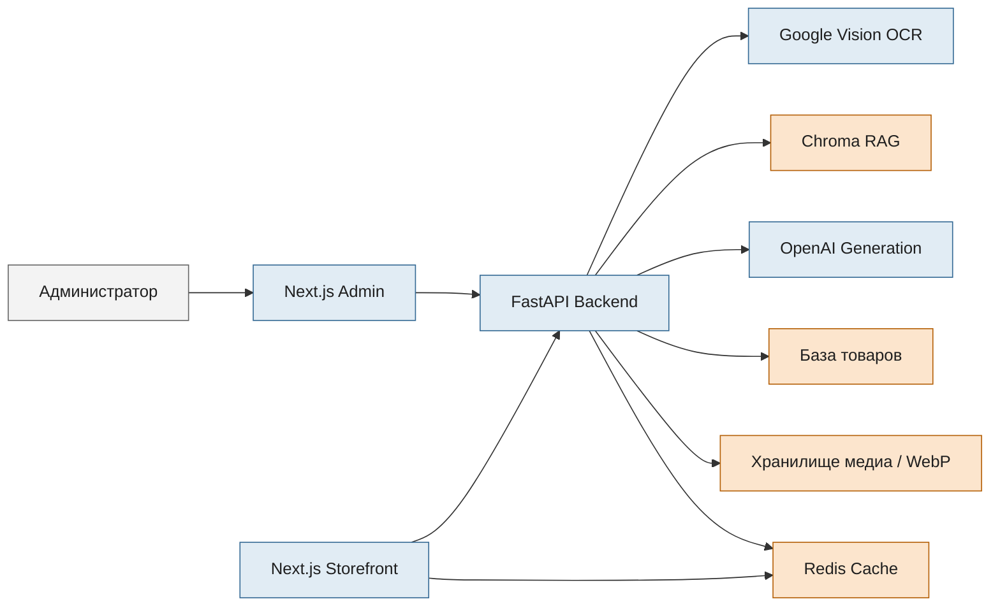

# Naramkova Moda v2

## Превращает изображения товаров в готовые карточки для продаж

> Загружайте 10, 50 или 100 изображений за раз.  
> Система анализирует изображения, извлекает визуальные и текстовые сигналы, подбирает нужный стиль через RAG, генерирует карточку товара, предлагает цену и отправляет результат прямо в e-commerce workflow.

## Зачем существует этот проект

Большинство магазинов тратит слишком много времени на ручное заполнение карточек товара. Этот проект построен на обратной логике:

- сначала изображения
- AI берет на себя рутинную работу с контентом
- RAG удерживает стиль в рамках реального магазина
- Redis снижает количество повторных дорогих операций
- администратор сохраняет контроль, но не делает все вручную

## Что делает проект сильным

| Возможность | Что это дает на практике |
| --- | --- |
| Массовая загрузка изображений | Можно обрабатывать большие партии, например 100 изображений за одну сессию |
| OCR / Vision pipeline | Извлекаются labels, objects, web entities и текст с изображения |
| Стабильность через RAG | Стиль и структура берутся из сохраненных шаблонов товаров в Chroma |
| Автогенерация draft | Создаются title, description, SEO-поля, теги и рекомендуемая цена |
| Прямое создание товаров | Обработанные изображения можно сразу назначать как product или variant |
| Ускорение через Redis | Повторно используемые данные кешируются и не гоняют тяжелые запросы лишний раз |

## Визуальный обзор

```mermaid
flowchart LR
    classDef source fill:#fff2cc,stroke:#b08900,color:#1f1f1f;
    classDef process fill:#d9ead3,stroke:#2f6f3e,color:#1f1f1f;
    classDef ai fill:#d0e0ff,stroke:#2c5aa0,color:#1f1f1f;
    classDef output fill:#f4cccc,stroke:#a61c1c,color:#1f1f1f;

    A["Массовая загрузка<br/>10 / 50 / 100 изображений"]:::source --> B["Admin Media Inbox"]:::process
    B --> C["Конвертация в WebP"]:::process
    C --> D["OCR / Vision анализ<br/>labels, objects, text"]:::ai
    D --> E["Нормализация тегов<br/>и определение типа товара"]:::process
    E --> F["RAG-поиск в Chroma<br/>шаблоны и примеры"]:::ai
    F --> G["LLM-генерация<br/>title, description, SEO, price"]:::ai
    G --> H["Проверка / назначение в admin"]:::process
    H --> I["Создание Product или Variant"]:::output
    I --> J["Появление на storefront"]:::output
```





## Основной AI-конвейер

1. Изображения товаров загружаются в admin media inbox.
2. Backend конвертирует файлы в WebP и сохраняет их в media workflow.
3. OCR / vision-обработка извлекает labels, objects, web entities и видимый текст.
4. Система нормализует теги и определяет вероятный тип товара.
5. Chroma RAG находит наиболее близкие шаблоны и примеры товаров.
6. AI-слой генерирует:
   - название товара
   - описание товара
   - тип товара
   - SEO title
   - SEO description
   - SEO keywords
   - рекомендуемую цену в CZK
7. Администратор назначает результат как новый product или variant.
8. Товар записывается в базу магазина и появляется в e-shop workflow.

## Почему RAG здесь критичен

Это не просто оболочка вокруг LLM. RAG-слой является одной из базовых частей проекта.

- Он удерживает тексты ближе к реальному стилю магазина.
- Он убирает случайный шаблонный AI-tone.
- Он повторно использует уже накопленные шаблоны и примеры из Chroma.
- Он снижает количество лишних повторных генераций через LLM.
- Он делает массовое превращение изображений в карточки товаров пригодным для production.

## Redis и производительность

Redis используется как слой in-memory cache для повторных чтений и часто запрашиваемых данных. В связке с RAG-first workflow это уменьшает количество дорогих операций и делает storefront и product flow быстрее.

## Что система генерирует

| Поле | Откуда берется |
| --- | --- |
| Title | Vision-сигналы + RAG-стиль + AI-генерация |
| Description | Vision-сигналы + шаблоны + AI draft |
| Product type | Определяется по нормализованным тегам |
| SEO-поля | Собираются из очищенного product draft |
| Suggested price | Формируется из pricing rules и признаков товара |
| Product media | Конвертируется и сохраняется в WebP workflow |

## Технологии

- Backend: Python 3.11, FastAPI, SQLAlchemy, Pydantic
- Frontend: Next.js 14, React 18, TypeScript, Tailwind CSS
- AI: Google Vision OCR / анализ изображений, OpenAI-based generation, Chroma RAG
- Infra: Docker Compose, Redis

## Структура проекта

- `backend/` FastAPI API, AI-модули, модели базы данных, тесты
- `frontend/client/` клиентская витрина магазина
- `frontend/admin/` admin-панель с media inbox и AI workflow
- `docker/` Dockerfiles
- `docker-compose.dev.yml` локальный dev-стек
- `docker-compose.prod.yml` production-style deployment

## Основные возможности

- e-commerce storefront и admin panel
- массовая загрузка изображений товаров
- извлечение атрибутов через OCR / vision
- генерация описаний товаров с помощью RAG
- автоматические draft-названия, описания, SEO-поля и рекомендации по цене
- прямое создание товаров и вариантов из загруженных изображений
- кеширование через Redis

## Локальная разработка

Требования:

- Docker Desktop

Запуск полного dev-стека:

```bash
cp .env.example .env.dev
docker compose -f docker-compose.dev.yml up --build
```

Локальные порты по умолчанию:

- Backend API: `http://localhost:8088`
- Client FE: `http://localhost:3002`
- Admin FE: `http://localhost:3012`

## Локальная разработка без Docker

Backend:

```bash
cd backend
python -m venv .venv
# Windows
.\\.venv\\Scripts\\activate
pip install -r requirements.txt
uvicorn app.main:app --reload --port 8080
```

Client FE:

```bash
cd frontend/client
npm ci
npm run dev
```

Admin FE:

```bash
cd frontend/admin
npm ci
npm run dev
```

## Тесты

```bash
pytest backend/tests
```

## Безопасность

- В публичном репозитории нет runtime-данных, загруженных медиафайлов и секретов.
- Не коммитьте реальные `.env*` файлы и приватные ключи.

## Лицензия

Файл лицензии пока не добавлен. Перед коммерческим или публичным переиспользованием его нужно добавить.
